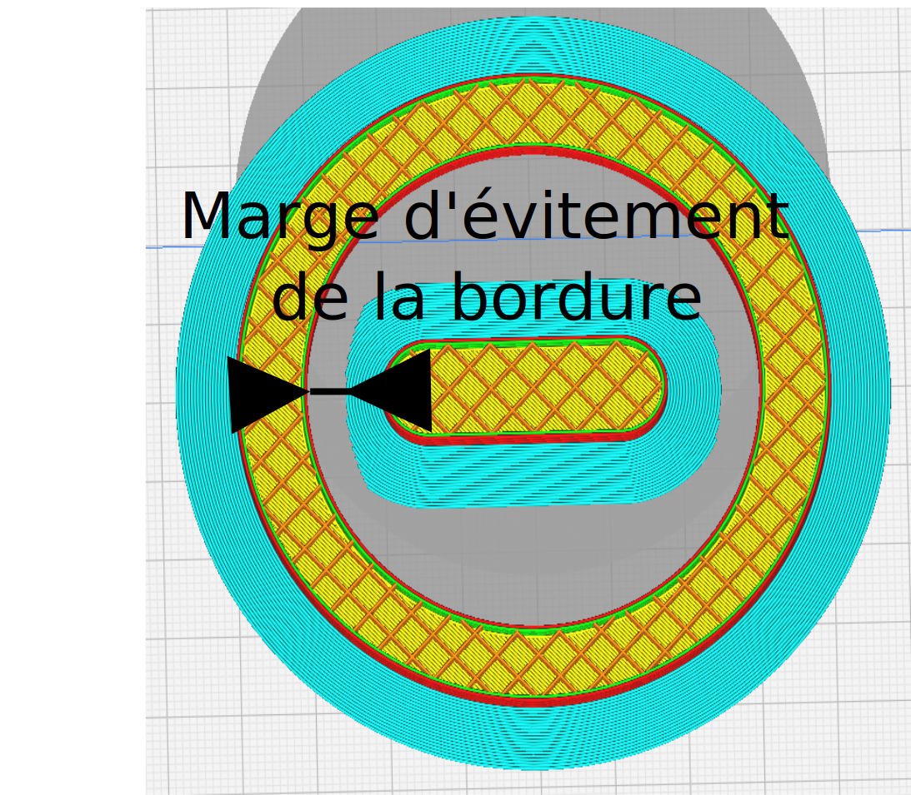

Marge d'évitement de la bordure intérieure
====

Une pièce entièrement enfermée dans une autre pièce peut générer une bordure extérieurs qui touche l'intérieur de l'autre pièce. Cela supprime toutes les bordures situées à cette distance spécifiée par cette valeur des trous internes.

Pour activer le paramètre [Bord uniquement sur l'extérieur](brim_outside_only.md) doit être activée.