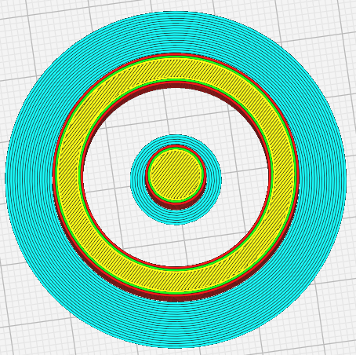
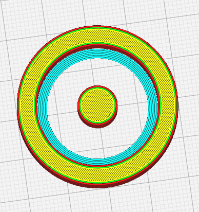

Emplacement de la bordure
====
Imprimez une bordure à l'extérieur du modèle, à l'intérieur, ou les deux. Selon le modèle, cela permet de réduire la quantité de bordure que vous devez enlever par la suite, tout en garantissant une bonne adhésion au plateau d'impression.

Vous avez le choix entre les options suivantes :

- Extérieur uniquement : Créer une bordure uniquement sur l'extérieur d'une pièce. 
- Intérieur uniquement : crée une bordureuniquement à l'intérieur d'une pièce.
- Partout : Créer des bordures à l'extérieur et à l'intérieur d'une pièce.

**Note** : La notion d'extérieur fait référence au bord situé à l'extérieur d'une partie de la pièce, mais qui peut se trouver à l'intérieur de la pièce entière.

Cette option n'est visible que si le paramètre [Type d'adhérence du plateau](adhesion_type.md) est défini sur **Bordure**.

