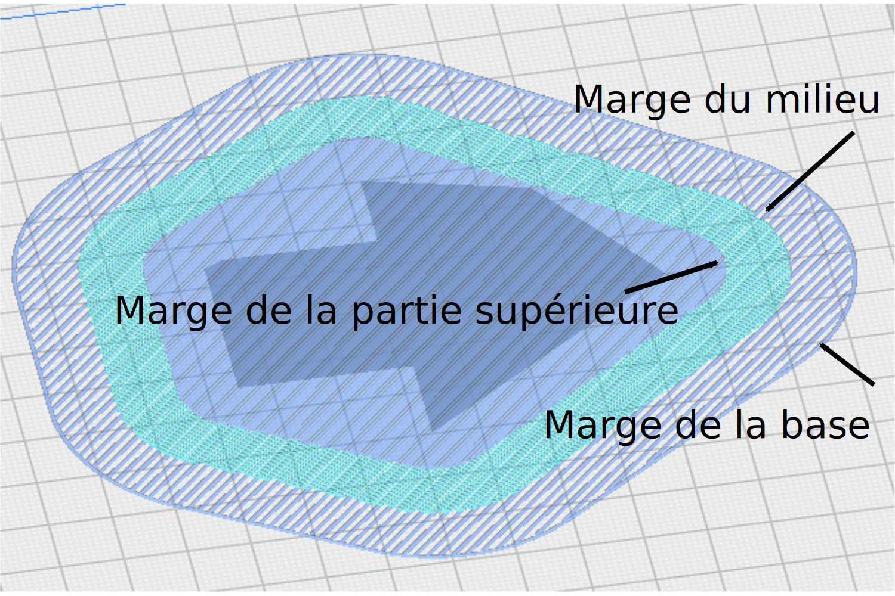

Marge supplémentaire de la base du radeau 
====
Si la base du radeau est activée, il s'agit de la zone de radeau supplémentaire autour du modèle qui reçoit également un radeau. En augmentant cette marge, vous créerez un radeau plus solide tout en utilisant plus de matériau et en laissant moins de surface pour votre impression.

