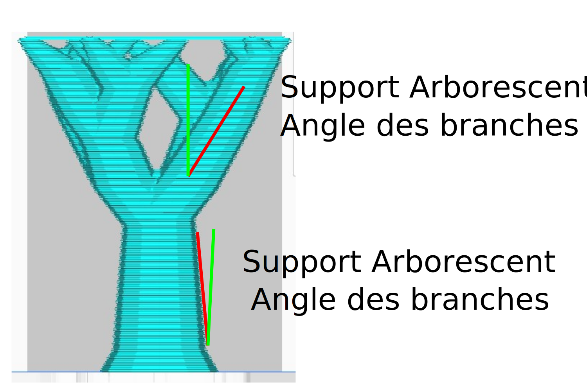

Angle des branches souhaité
====
Ce paramètre détermine l'angle préféré pour les branches, lorsqu'elles ne doivent pas éviter le modèle. Si vous utilisez un angle faible, les branches seront plus verticales et plus stables. Si vous utilisez un angle élevé, les branches fusionneront plus rapidement.

