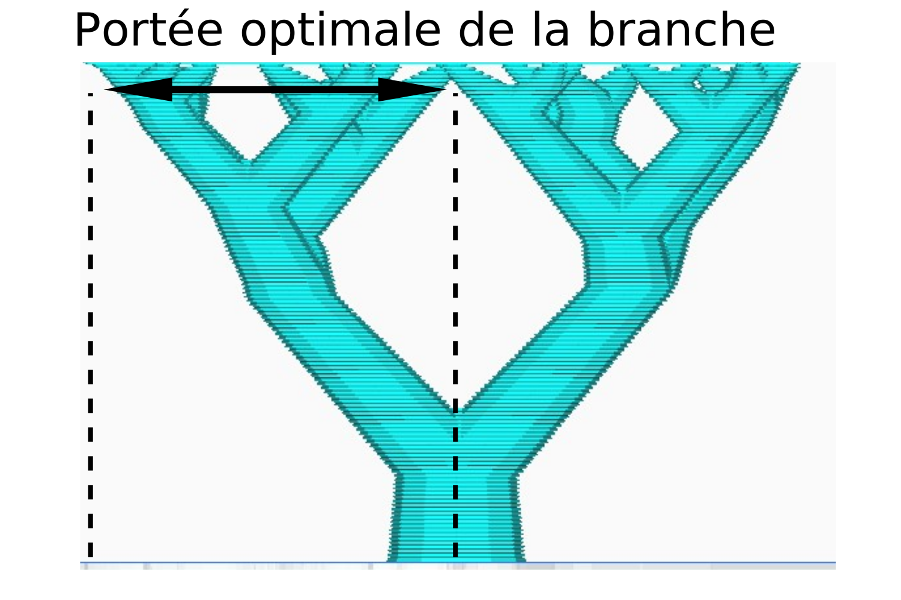

Portée optimale des branches
====
Une recommandation sur la distance à laquelle les branches peuvent s'éloigner des points qu'elles soutiennent. Les branches peuvent violer cette valeur pour atteindre leur destination (plaque de construction ou partie plate du modèle). L'abaissement de cette valeur rendra le support plus solide, mais augmentera le nombre de branches (et par conséquent l'utilisation de matériaux et le temps d'impression).

