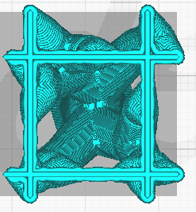
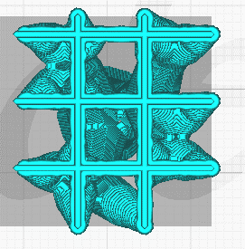

Densité des branches
====

Ce paramètre ajuste la densité de la structure de support utilisée pour générer les extrémités des branches. Une valeur plus élevée produira de meilleurs surplombs, mais les supports seront plus difficiles à enlever. Utilisez un plafond de support pour les valeurs très élevées, ou veillez à ce que la densité du support soit également élevée aux extrémités.

