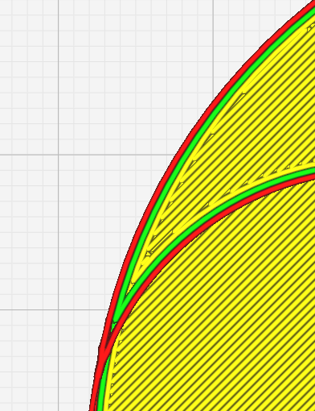
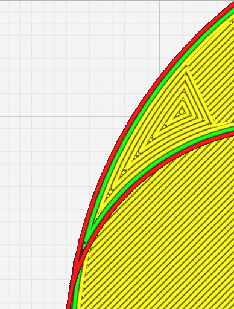

Petite largeur du dessus/dessous
====

Cette valeur définit la taille des **Petites régions haut/bas** qui sont remplies avec le tracé parallèle des contours au lieu du [motif du dessus/dessous](top_bottom_pattern.md) par défaut. 

Avec **[Petit haut/bas sur la surface](small_skin_on_surface.md)**, vous pouvez exclure le paramètre sur la surface en activant ou non la valeur spécifiée dans cette option.

Dans les images ci-dessous, vous pouvez voir la différence d'orientation du motif lorsque la zone de remplissage est plus petite que la valeur spécifiée dans ce paramètre.

